# 
**Scrum Sisters - Testing**

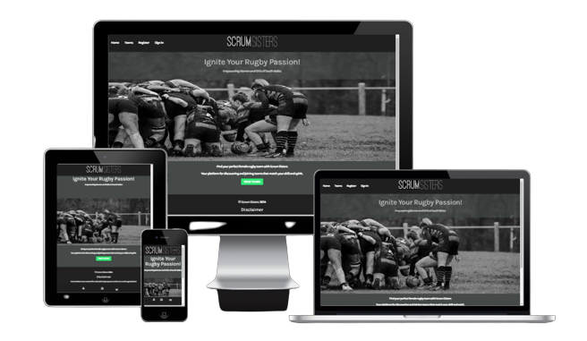

[View the Scrum Sisters live website here](https://scrum-sisters-f6136ef90930.herokuapp.com/)

# **Manual Testing**

# **Validation Testing**

## **HTML Validation**

HTML

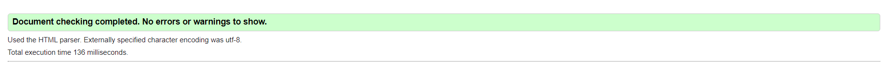

## **CSS Validation**

style.css

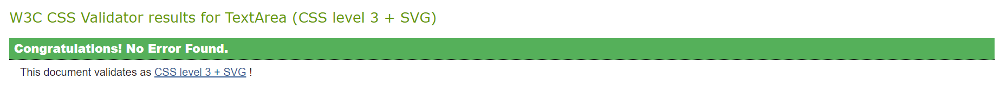

## **Python Validation**

__init.py__

Passed

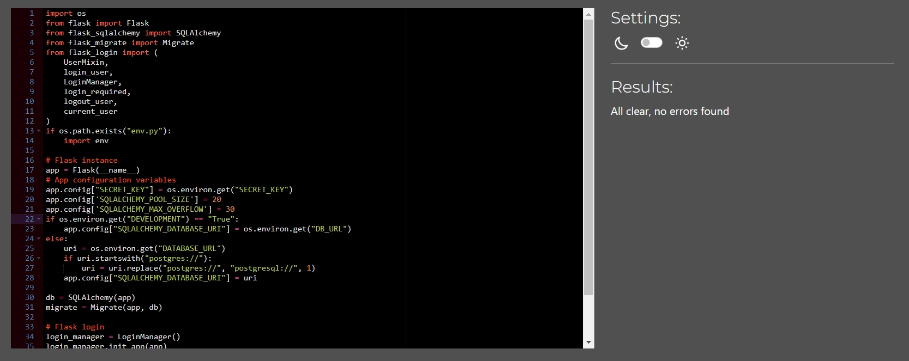

models.py

Passed

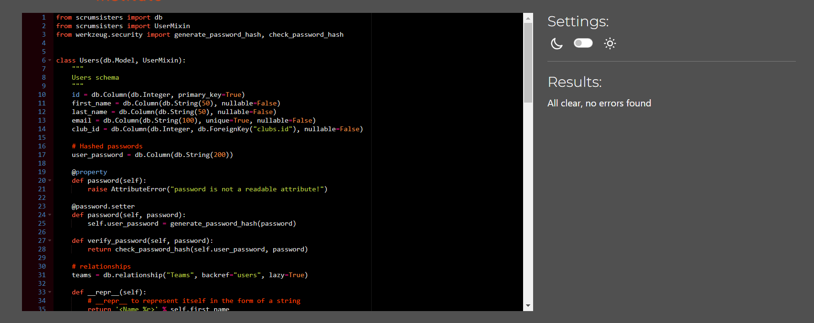

forms.py

Passed

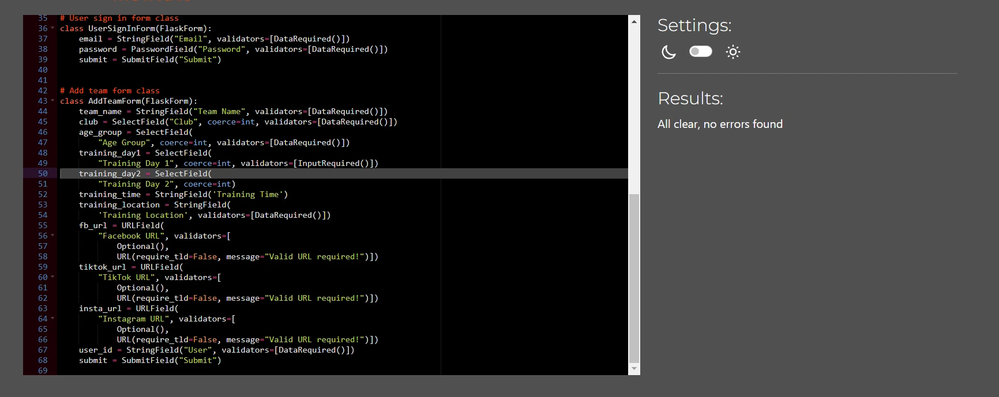

run.py

Passed

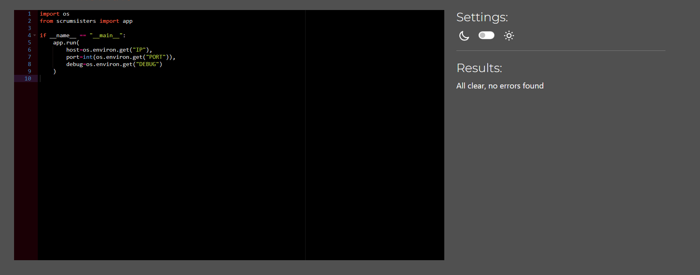

models.py

Passed

## **User Stories Testing**
**Non-account holders**

|**User Need**|**Achieved?**|**How?**
|---|---|---|
|As a user with no account, I want to find teams easily.|Yes| Link to teams page placed in the navigation bar and button to view teams on home page.
|As a user with no account, looking for girls teams I want to find the age range of the girls teams.|Yes| Age group is included in the teams profile, displayed on the Teams page when the team name is clicked.
|As a user with no account, I want to find the training location details.|Yes| Training Location is included in the teams profile, displayed on the Teams page when the team name is clicked.
|As a user with no account, I want to find training day and time for the team.|Yes| Training day and time information is included in the teams profile, displayed on the Teams page when the team name is clicked.
|As a user with no account, I want to easily register an account and sign in.|Yes| Register link is included on the nav bar. The link is only visible when no user is signed in. The Sign in button is also included in the nav bar. There is also a call to action for registration on the home page.

**Account holders**
|**User Need**|**Achieved?**|**How?**
|---|---|---|
|As a user with an account, I want to be able to sign into my account easily.|Yes| Sign in button is located on the nav bar. On mobile screens the sign in button specifically is located in the side nav, however if a user clicks the person button in the bottom left and isn't signed in to an account the sign in page will appear.
|As a user with an account, I want to be able to edit my account details easily.|Yes| There is a pencil icon located in the top right of the user profile container. The icon is tooltipped using Materialize CSS and displays edit profile when hovered. When clicked the user will be taken to the edit user page. The user's details are already populated on the edit form except the password.
|As a user with an account, I want to be able to delete my account easily.|Yes| Underneath the user details on the user profile page there is a large red 'Delete Account' button. When pressed a modal displays prompting the user to confirm deletion.
|As a user with an account, I want to be able to upload a team.|Yes| When users register, they need to select a club. Within their profile page this club will display at the bottom. When a user clicks on their club their club teams page displays. Each team will populate in grid format with the last square holding an 'add team' button which takes the user to the add team page.
|As a user with an account, I want to be able to edit my team information.|Yes| There is a pencil icon located in the top right of the team profile container. The icon is tooltipped using Materialize CSS and displays edit profile when hovered. When clicked the user will be taken to the edit team page. The team's details are already populated on the edit form.
|As a user with an account, I want to be able to delete my team.|Yes| Underneath the user details on the team profile page there is a large red 'Delete Account' button. When pressed a modal displays prompting the user to confirm deletion.
|As a user with an account, I want to be able to sign out of my account.|Yes| Sign out link is located on the top nav and sidenav and displays only when a user is signed in.
|As a user with an account, I want to add links to my team's social media.|Yes| The add team form contains fields for Facebook URL, TikTok URL and Instagram URL. The social icons also display on the team profile card on the teams page. When clicked the teams's social page will display in a new window.

## **Responsiveness**

The feature testing was completed on all of the following devices.
The Sign in Page on iPad Air & Mini setting in Chrome Dev Tools displays the footer high on the page.
I further tested this by changing the responsive dimensions and the footer displayed perfectly.

**Mobile:**
- iPhone 6/7/8

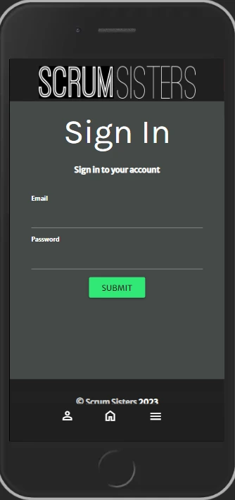

- iPhone X

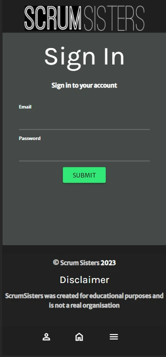
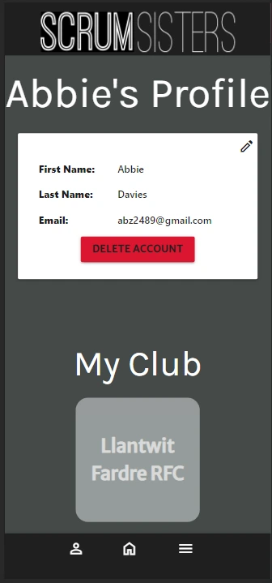

**Tablet**
- iPad Mini

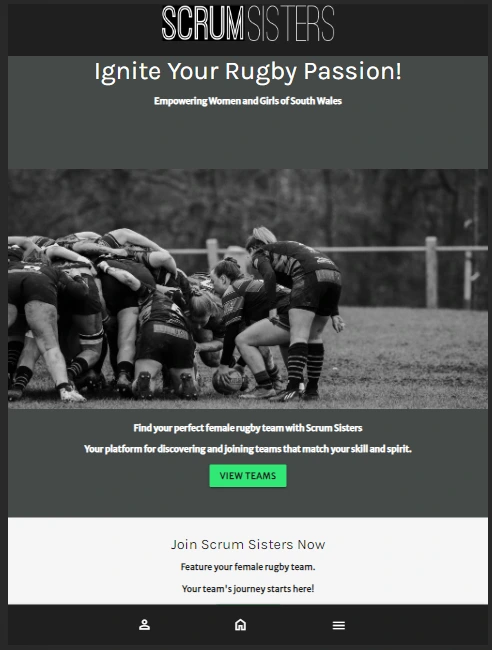
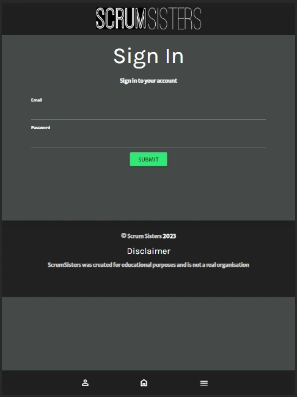
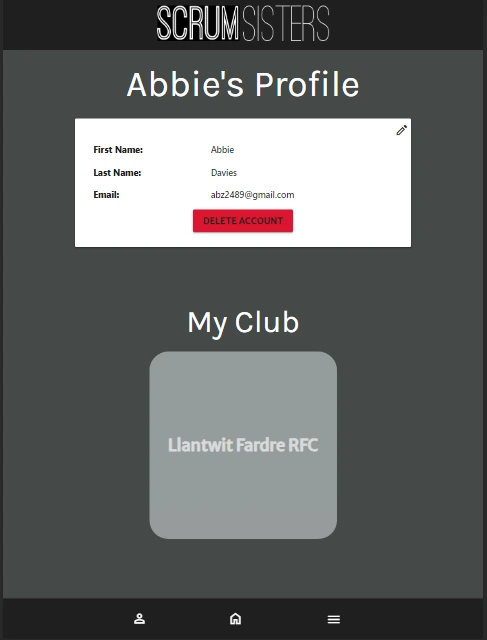  

- ipad Air

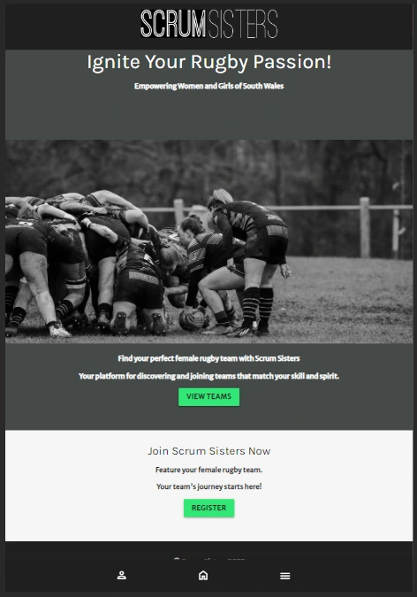
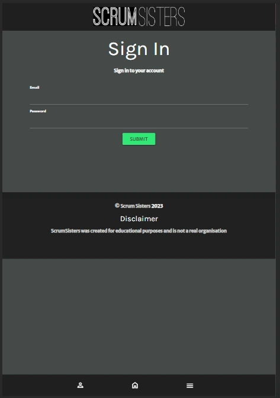
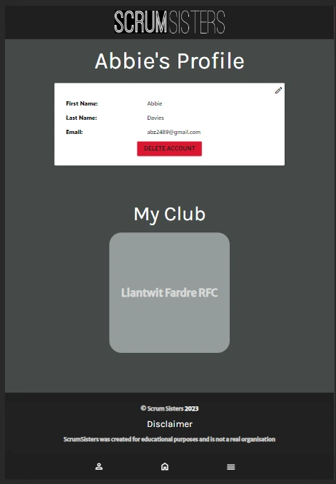  

**Desktop**

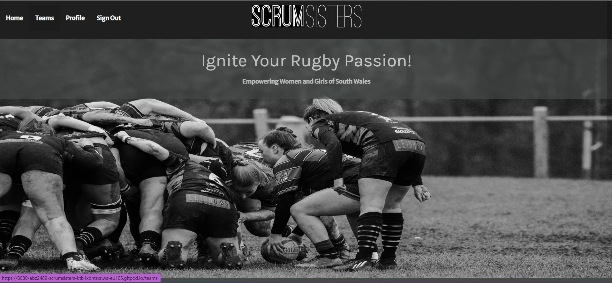

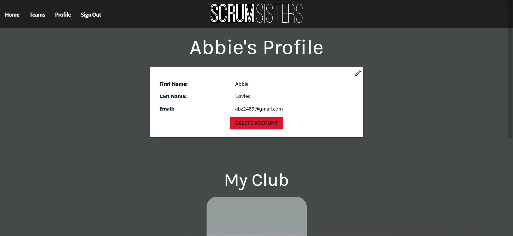

## **Feature Testing**

### **base.html**
|**Feature**|**Expected Result**|**How to Test**|**Result**|**Pass/Fail**|
|---|---|---|---|---|
|Top Nav|Shows 4 nav links. When user is signed out; HOME, TEAMS, REGISTER, SIGN IN. When user is signed in; HOME, TEAMS, PROFILE, SIGN OUT|Sign in and out|Pass
|Top Nav|Hover effect over nav links|Hover nav links|Hovered links display darker|Pass
|Bottom Nav|Displays on mobile and tablet devices|Choose mobile and tablet devices in Chrome Dev Tools|Top navigation links disappear, bottom nav appears with three icons for profile/sign in, home and side nav|Pass
|Mobile side nav button|Side nav pops out and when clicked away from side nav it disappears|Click sidenav button once to pop out, click content behind sidenav close|Sidenav opens and closes as expected|Pass
|Bottom nav profile button|When user is signed in this button navigates to the user's profile. If no user is signed in, it navigates to the sign in page|Press button when signed out and again when signed in|Pass

### **index.html**
|**Feature**|**Expected Result**|**How to Test**|**Result**|**Pass/Fail**|
|---|---|---|---|---|
|Hero Image|Is responsive across all screen sizes|Select different screen sizes in dev tools|Hero image is responsive|Pass
|View Teams Button|Navigates to the teams page|Click teams button|Navigates to teams page|Pass
|Register Button|Navigates to the register page|Click register button|Navigates to the register page|Pass

### **teams.html**
|**Feature**|**Expected Result**|**How to Test**|**Result**|**Pass/Fail**|
|---|---|---|---|---|
|Team Square|Is responsive across all screen sizes|Select different screen sizes in dev tools|Team Square is responsive|Pass
|Team name activator (Materialize CSS)|When clicked team information reveals|Click Team Name or more button|Team information reveals|Pass
|Team Name (on reveal)|When clicked team information closes|Click team name or X in right corner|Team information closes|Pass
|Social icon links|All three should open in a new window to the team's fb, tiktok or instagram profiles|Click the icons|Pass

### **signin.html**
|**Feature**|**Expected Result**|**How to Test**|**Result**|**Pass/Fail**|
|---|---|---|---|---|
|Sign in form (correct info)|When correct information is input and submitted, the user's profile page will display|Complete the form and click submit (must have valid account)|User profile displays|Pass
|Sign in form(incorrect info)|Displays flash message prompting user to try again or register for an account|Enter non registered email and password|Flash message displays|Pass
|User doesn't exist' flash message|Displays flash message with the error|Enter non registered email and password|Flash message displays|Pass
|Flash message register link|Register is a link and will navigate the user to the registration page|Submit non registered info to the form and click register link (in bold) in the flash message|Takes user to the registration page|Pass
|Submit button|Submits the sign in form|Fill in the form and click submit|Signed in successfully with valid registered info|Pass

### **register.html**
|**Feature**|**Expected Result**|**How to Test**|**Result**|**Pass/Fail**|
|---|---|---|---|---|
|form|Prompts user to fill in required fields if left blank|Submit the form with blank that displays *|'Please fill in this field' prompt displays|Pass
|Clubs select field|Displays list of clubs in the database|Click the arrow on the clubs field|All clubs in the database display|Pass
|Submit button|Submits the registration form|Fill in the form and click submit|Registered successfully with valid info|Pass
|flash message successfull|When all information is completed correctly and submitted the 'Registration Successful' flash message displays|Complete form and submit|Flash message displays|Pass
|Passwords error message|Displays when password field doesn't match the confirm password field|Complete form with different password in the password field to the confirm password field|Flash message displays|Pass

### **profile.html**
|**Feature**|**Expected Result**|**Test Performed**|**Result**|**Pass/Fail**|
|---|---|---|---|---|
|Profile card|Populates user information entered in the registration form, but no password|Sign in and click profile|User information is populated|Pass
|Edit pencil with tooltip|Edit pencil diaplys tooltip when hovered and displays edit user profile when clicked|Hover and click pencil|Tooltip displays when hovered, edit user info page displays when clicked|Pass
|Delete Account button|Displays prompt modal to avoid accidental deletion|Click delete account button|'are you sure you want to delete' modal displays with yes or no buttons|Pass
|yes button|Delete's useer account and returns user to the registration page|Click yes button|Deletes the account and returns user to registration page|Pass
|no button|Closes the modal and displays the user profile|Click no button|Modal closes and profile is displayed|Pass
|User account deleted flash message|When user deletes account flash message will display|Delete account by clicking delete account, and clicking yes|Flash message displays|Pass
|Club Square|Populates the user's club|Scroll to my club section|Club name displays|Pass

### **edit_user_profile.html**
|**Feature**|**Expected Result**|**Test Performed**|**Result**|**Pass/Fail**|
|---|---|---|---|---|
|form|Populates with user information, except password and confirm password fields are blank|Click edit pencil on user profiel card to load edit profile page|User information is populated, password and confirm password fields are blank|Pass
|Submit Button|Sends form with updates information to database|Complete form, change some details, click submit|Form submits and information is updated in the team profile, password change was checked using psql to query the database in the terminal and by signing in|Pass

### **clubs_page.html**
|**Feature**|**Expected Result**|**Test Performed**|**Result**|**Pass/Fail**|
|---|---|---|---|---|
|Team Square|Is responsive across all screen sizes|Select different screen sizes in dev tools|Team Square is responsive|Pass
|Teams grid|Displays vertically on mobile and horizantally on desktop|Select different screen sizes in dev toold|Teams Grid isn't displaying horizantally on desktop screens|Fail
|Team Square|Populates team name|Click club name on club page|Team Square populates team name|Pass
|Add team button|Tkes user to add team page|Click add team button|Add team form displays|Pass

### **add_team.html**
|**Feature**|**Expected Result**|**Test Performed**|**Result**|**Pass/Fail**|
|---|---|---|---|---|
Unexpected last minute problems with add_team.html. The form submits successfully but is displaying an error
Team profile also not loading as a result testing for edit team profile also hasn't been possible.