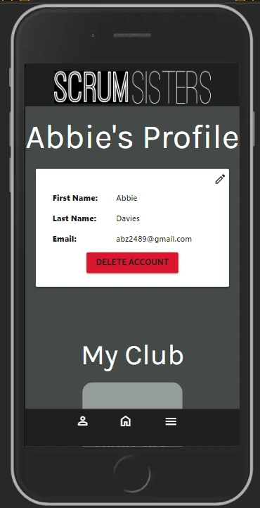
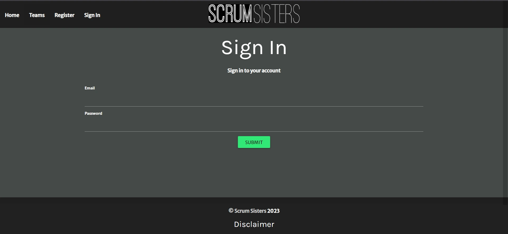

# 
**Scrum Sisters - Testing**

[View the Scrum Sisters live website here](https://scrum-sisters-f6136ef90930.herokuapp.com/)

# **Manual Testing**

## **User Stories Testing**
**Non-account holders**

|**User Need**|**Achieved?**|**How?**
|---|---|---|
|As a user with no account, I want to find teams easily.|Yes| Link to teams page placed in the navigation bar and button to view teams on home page.
|As a user with no account, looking for girls teams I want to find the age range of the girls teams.|Yes| Age group is included in the teams profile, displayed on the Teams page when the team name is clicked.
|As a user with no account, I want to find the training location details.|Yes| Training Location is included in the teams profile, displayed on the Teams page when the team name is clicked.
|As a user with no account, I want to find training day and time for the team.|Yes| Training day and time information is included in the teams profile, displayed on the Teams page when the team name is clicked.
|As a user with no account, I want to easily register an account and sign in.|Yes| Register link is included on the nav bar. The link is only visible when no user is signed in. The Sign in button is also included in the nav bar. There is also a call to action for registration on the home page.

**Account holders**
|**User Need**|**Achieved?**|**How?**
|---|---|---|
|As a user with an account, I want to be able to sign into my account easily.|Yes| Sign in button is located on the nav bar. On mobile screens the sign in button specifically is located in the side nav, however if a user clicks the person button in the bottom left and isn't signed in to an account the sign in page will appear.
|As a user with an account, I want to be able to edit my account details easily.|Yes| There is a pencil icon located in the top right of the user profile container. The icon is tooltipped using Materialize CSS and displays edit profile when hovered. When clicked the user will be taken to the edit user page. The user's details are already populated on the edit form except the password.
|As a user with an account, I want to be able to delete my account easily.|Yes| Underneath the user details on the user profile page there is a large red 'Delete Account' button. When pressed a modal displays prompting the user to confirm deletion.
|As a user with an account, I want to be able to upload a team.|Yes| When users register, they need to select a club. Within their profile page this club will display at the bottom. When a user clicks on their club their club teams page displays. Each team will populate in grid format with the last square holding an 'add team' button which takes the user to the add team page.
|As a user with an account, I want to be able to edit my team information.|Yes| There is a pencil icon located in the top right of the team profile container. The icon is tooltipped using Materialize CSS and displays edit profile when hovered. When clicked the user will be taken to the edit team page. The team's details are already populated on the edit form.
|As a user with an account, I want to be able to delete my team.|Yes| Underneath the user details on the team profile page there is a large red 'Delete Account' button. When pressed a modal displays prompting the user to confirm deletion.
|As a user with an account, I want to be able to sign out of my account.|Yes| Sign out link is located on the top nav and sidenav and displays only when a user is signed in.
|As a user with an account, I want to add links to my team's social media.|Yes| The add team form contains fields for Facebook URL, TikTok URL and Instagram URL. The social icons also display on the team profile card on the teams page. When clicked the teams's social page will display in a new window.

## **Responsiveness**

The feature testing was completed on all of the following devices.
The Sign in Page on iPad Air & Mini setting in Chrome Dev Tools displays the footer high on the page.
I further tested this by changing the responsive dimensions and the footer displayed perfectly.

**Mobile:**
- iPhone 6/7/8

- iPhone X

**Tablet**
- iPad Mini

  

- ipad Air

  

**Desktop**

